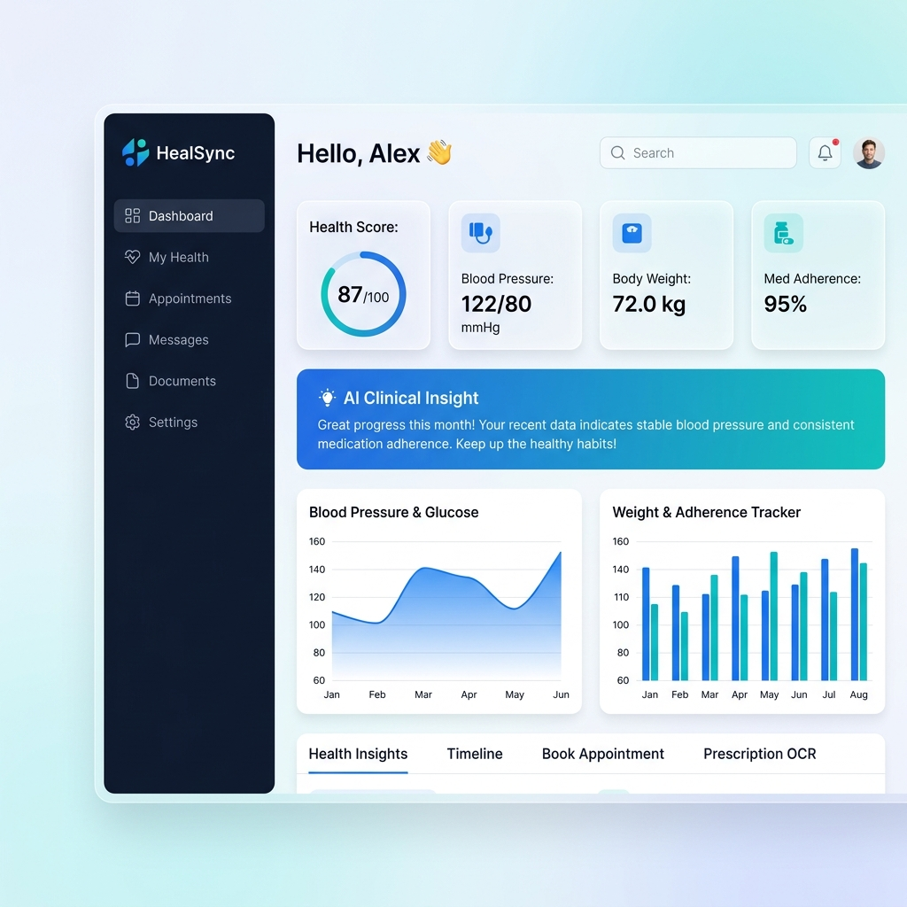
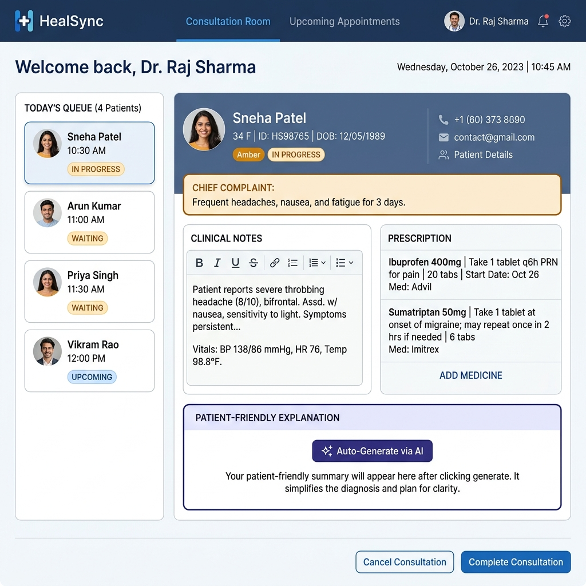
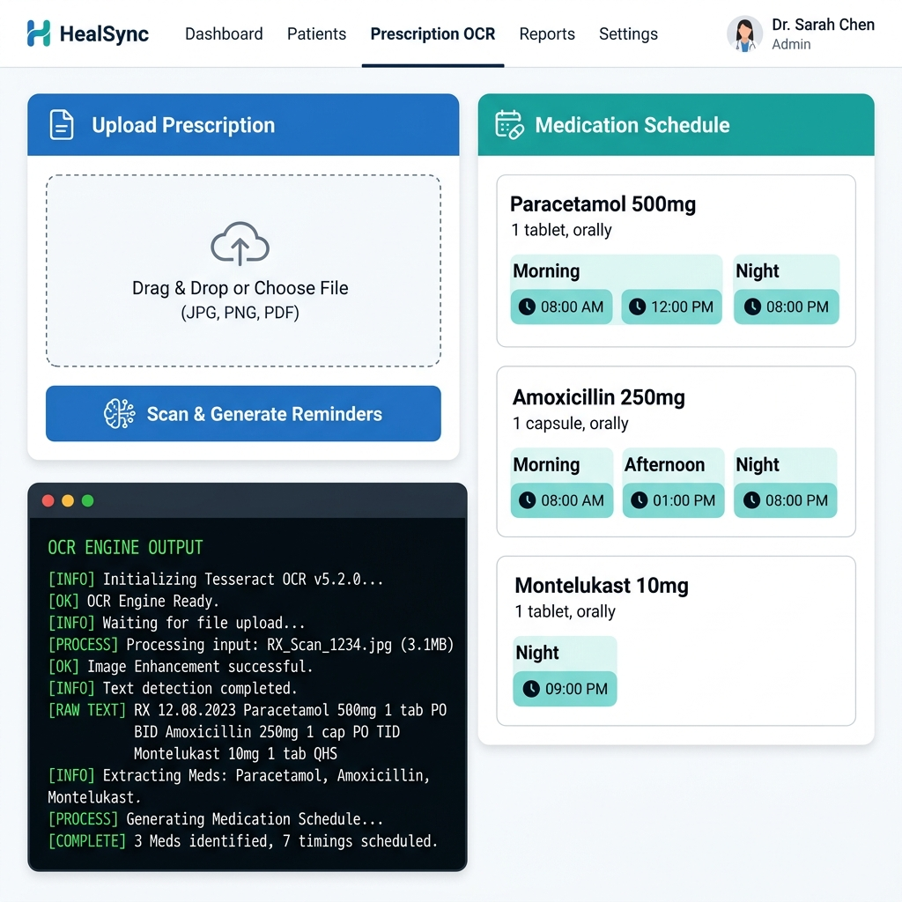
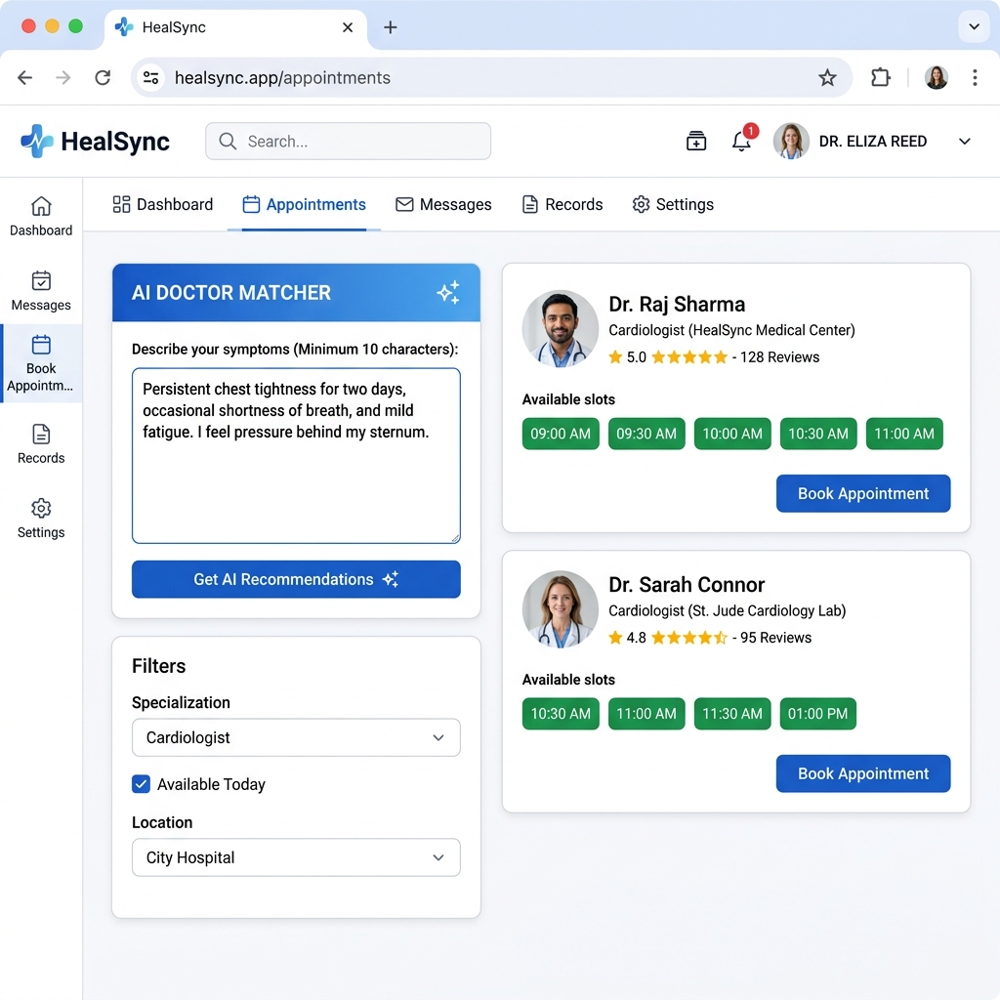
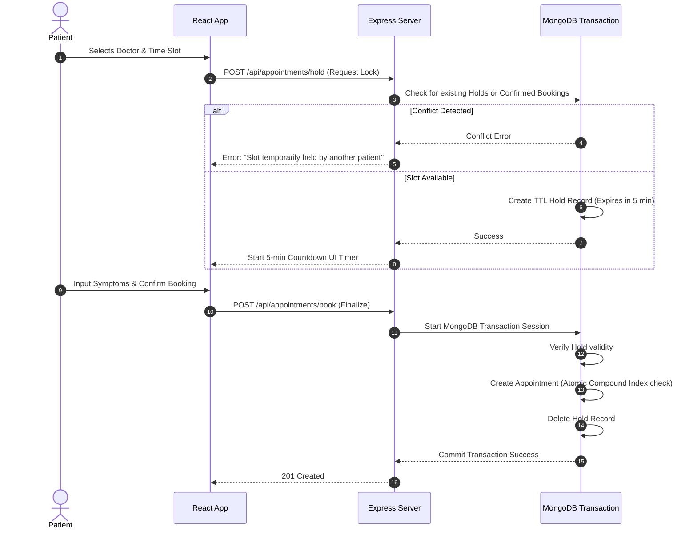
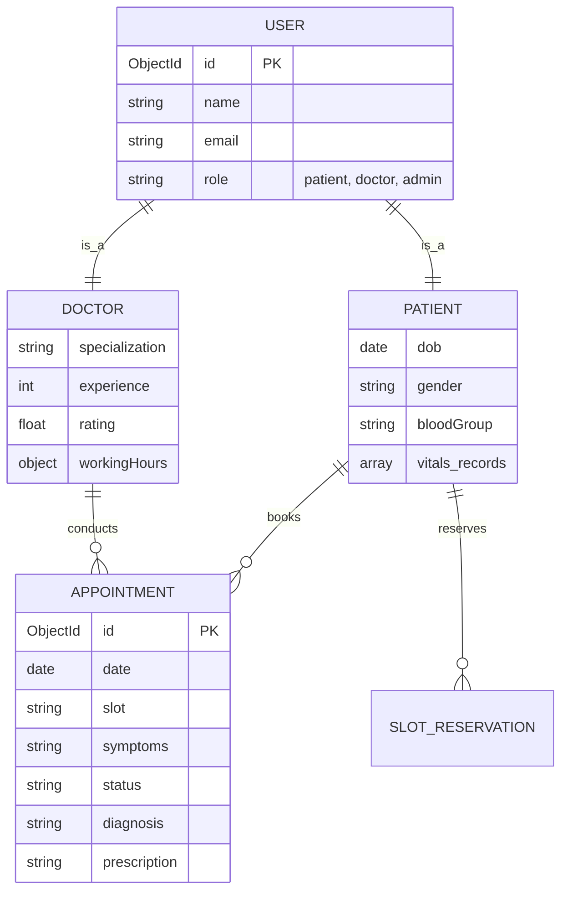

<div align="center">
  
  # 🏥 HealSync: Intelligent Healthcare Appointment & Clinical Platform
  
  **An enterprise-grade, highly polished clinical workflow manager built with the MERN stack.**  
  *Designed with premium glassmorphism aesthetics and powered by advanced AI modules for triage, OCR, and smart scheduling.*

  [](https://react.dev)
  [](https://nodejs.org)
  [](https://www.mongodb.com/)
  [](https://tailwindcss.com/)
  [](#)

</div>

<br />

---

## 📸 Platform Previews

> **Note to Recruiters:** *This project features a meticulously crafted UI using TailwindCSS, Framer Motion, and Recharts to deliver a premium user experience.*

<div align="center">
  <table>
    <tr>
      <td align="center"><b>🩺 Patient Dashboard — Health Insights & AI Booking</b></td>
      <td align="center"><b>👨‍⚕️ Doctor Dashboard — Clinical Consultation Room</b></td>
    </tr>
    <tr>
      <td></td>
      <td></td>
    </tr>
    <tr>
      <td align="center"><b>🤖 AI Prescription OCR Scanner</b></td>
      <td align="center"><b>📅 Smart Doctor Booking Panel</b></td>
    </tr>
    <tr>
      <td></td>
      <td></td>
    </tr>
  </table>
</div>

---

## ✨ Key Features & Technical Highlights

### 🎨 Aesthetic & Dynamic UI
- **Modern Design System:** Curated color palettes featuring HSL-tailored dark/light layouts, glassmorphism overlays, and smooth micro-animations powered by **Framer Motion**.
- **Interactive Analytics:** Real-time health trend visualizations using **Recharts**.

### 🧠 Advanced Clinical AI Integration
- **AI Triage & Risk Warning:** Real-time NLP symptom checks that categorize patients into risk levels (Red, Orange, Yellow, Green) to prioritize emergency care.
- **AI Prescription Scanner (OCR):** Server-side image parsing using **Tesseract.js** to extract medication regimens from handwritten or printed prescriptions and auto-generate schedules.
- **Smart Doctor Matching:** Algorithm that maps patient symptoms to the most relevant clinical specialists based on confidence scores, rating, and expertise.
- **Automated Patient Summaries:** AI-generated plain-English explanations of clinical notes to improve patient comprehension.

### 🛡️ Enterprise-Grade Backend Architecture
- **Concurrency & Double-Booking Prevention:** Implements strict **MongoDB ACID Transactions** and compound indexing to completely eliminate race conditions during high-traffic appointment booking.
- **5-Minute Slot Holding System:** Temporary TTL-based document locks that hold appointment slots while the patient fills out details, mirroring enterprise booking platforms (e.g., airline ticketing).

---

## 🏗️ System Architecture

Our robust architecture ensures separation of concerns, scalability, and secure data flow.

```mermaid
graph TD
  subgraph Frontend [React 19 Client UI]
    A[Vite Router] --> B[Auth Context / Role Guards]
    B --> C[Patient Dashboard (Insights, OCR, Booking)]
    B --> D[Doctor Room (Queue, AI Summaries)]
    B --> E[Admin Analytics]
  end

  subgraph Backend [Node.js / Express Server]
    F[Auth / JWT Middleware] --> G[Clinical Appointment Scheduler]
    F --> H[AI Triage & OCR Engine]
    F --> I[Notification / Mailer Service]
  end

  subgraph Database [MongoDB Cluster]
    J[(Users & Profiles)]
    K[(Appointments - Unique Compound Indices)]
    L[(SlotReservations - TTL 5-min Holds)]
  end

  C --> F
  D --> F
  E --> F
  G --> K
  G --> L
  H --> J
```

---

## ⏱️ Technical Deep-Dive: Concurrency-Safe Booking

Handling simultaneous booking requests is a critical challenge in healthcare software. HealSync solves this using **MongoDB Transactions** and a **Holding Queue**.



---

## 🧬 Entity Relationship Model



---

## 🛠️ Environment Configuration

Create a `.env` file in the `/server` directory:

```env
PORT=5000
MONGO_URI=mongodb://localhost:27017/healsync
JWT_SECRET=supersecret-healsync-token-key-321
JWT_EXPIRE=30d
NODE_ENV=development

# SMTP Configurations (for mail notifications)
EMAIL_HOST=smtp.mailtrap.io
EMAIL_PORT=2525
EMAIL_USER=your_username
EMAIL_PASS=your_password
```

---

## 🚀 Quick Start Guide

### Prerequisites
- Node.js (v18+)
- MongoDB (Running locally or via Atlas)

### Step 1: Clone & Setup Backend
```bash
# Navigate to server directory
cd server

# Install dependencies
npm install

# Seed the database with mock doctors and patients
npm run seed

# Start the development server (runs on port 5000)
npm run dev
```

### Step 2: Setup Frontend
Open a new terminal window:
```bash
# Navigate to client directory
cd client

# Install dependencies
npm install

# Start the Vite development server
npm run dev
```

---

## 📡 REST API Core Endpoints

| Method | Endpoint | Description | Access |
|---|---|---|---|
| `POST` | `/api/auth/register` | Register a new patient account | Public |
| `POST` | `/api/auth/login` | Authenticate user and return JWT | Public |
| `POST` | `/api/appointments/hold` | Place a 5-minute TTL hold on a time slot | Patient |
| `POST` | `/api/appointments/book` | Finalize booking using MongoDB Transactions | Patient |
| `GET` | `/api/appointments/doctor`| Fetch consultation schedule for the day | Doctor |
| `PUT` | `/api/appointments/:id/consult`| Save diagnosis and generate AI patient summary | Doctor |
| `POST` | `/api/ai/triage` | NLP-based symptom risk classification | Patient |
| `POST` | `/api/ai/ocr-scan` | Optical Character Recognition for prescriptions | Patient |
| `GET` | `/api/doctors` | Fetch all doctors and available slots for booking | Patient |

<br/>

---
<div align="center">
  <i>Developed with ❤️ for optimizing clinical workflows and patient care.</i>
</div>
